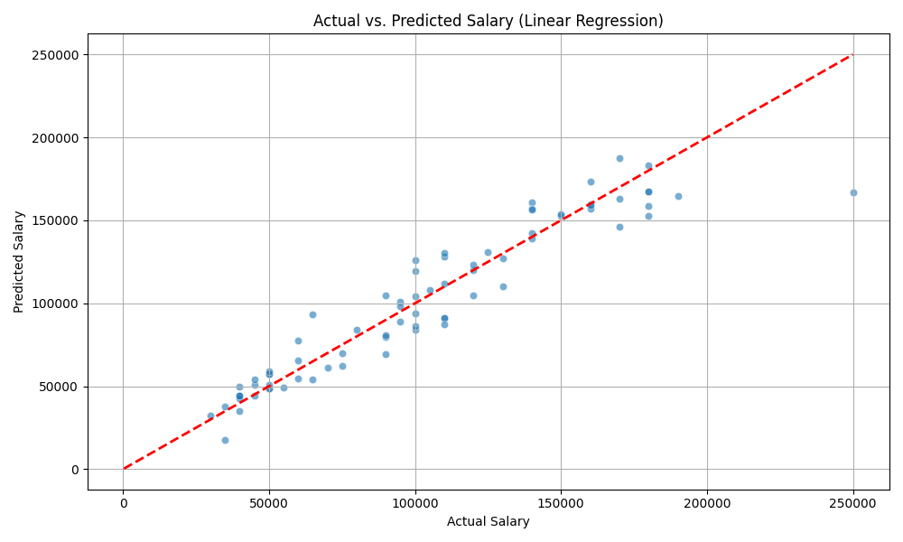

# Salary Prediction Tool

A user-friendly web application that leverages machine learning to **predict employee salaries** based on customizable features such as age, gender, education, job title, and experience. This tool is ideal for HR professionals, job seekers, and data science learners who want instant and accurate salary estimates using modern regression techniques.

## 🚀 Demo

Launch the application instantly:  
**[Open Salary Prediction Tool](https://heart-risk-predict.streamlit.app/)**

---

## 🖼️ App Walkthrough

### App Banner and Model Info


### User Input Form


### Projected Salary Output Example


### Actual vs Predicted Salary Chart


---

## 📝 Features

- **Instant Salary Prediction:** Enter employee details and get an immediate annual compensation estimate.
- **Modern Interface:** Clean and easy-to-use UI built with Streamlit.
- **Multi-Factor Estimation:** Considers Age, Gender, Education Level, Job Title, and Years of Experience.
- **Interactive Visualization:** Compare actual vs. predicted salaries with evaluation charts.
- **Model Performance Metrics:** View R² Score (model accuracy rating) in the app.
- **Fast & Secure:** Your data is processed locally in your browser session—no sensitive info stored.

---

## 📦 Tech Stack

| Layer           | Technology                                 |
|-----------------|--------------------------------------------|
| Frontend (UI)   | [Streamlit](https://streamlit.io/)         |
| Machine Learning| XGBoost Regressor ([xgboost](https://xgboost.ai/)) |
| Data            | Pandas, NumPy                              |
| Deployment      | Streamlit Community Cloud                  |
| Others          | Scikit-learn, Joblib, Pillow               |

---

## 🚦 How To Use

1. **Visit the App:**  
   [https://salary-prediction-tool-saksham-bindal.streamlit.app/](https://salary-prediction-tool-saksham-bindal.streamlit.app/)

2. **Input Fields:**  
   - **Age:** Enter the employee's age (18-80).
   - **Gender:** Choose from available gender options.
   - **Education Level:** Select highest education attained.
   - **Job Title:** Choose job/post from dropdown.
   - **Years of Experience:** Enter total relevant work experience.

3. **Click** `Calculate Salary`.

4. Review the model’s performance chart at the bottom.

---

## 🛡️ Model & Data

- **Algorithm:** XGBoost Regressor  
- **Preprocessing:** Label Encoding for categorical variables; StandardScaler for numeric normalization  
- **Performance:** R² Score = 94.58%, displayed on the interface  

> _Note: Salary predictions are based on a trained model and may vary from actual market values. Use for educational and reference purposes._

---

## 🛠️ Local Setup (for Developers)

1. **Clone this repository:**
    ```
    git clone https://github.com/SakshamBindal17/salary-prediction-tool.git
    cd salary-prediction-tool
    ```

2. **Create & activate a virtual environment** (optional but recommended):
    ```
    python -m venv venv
    ```
    # On Windows:
    ```
    .\venv\Scripts\activate
    ```
    # On macOS/Linux:
    ```
    source venv/bin/activate
    ```

4. **Install dependencies:**
    ```
    pip install -r requirements.txt
    ```

5. **Run the app locally:**
    ```
    streamlit run app.py
    ```

---

## 📁 Files in This Repo

| File/Folder                 | Description                                                            |
|-----------------------------|------------------------------------------------------------------------|
| `app.py`                    | Main Streamlit application code                                         |
| `requirements.txt`          | Python dependencies list                                                |
| `salary_predictor.pkl`      | Pre-trained ML model and encoders, used for making predictions          |
| `images/banner.png`         | App Banner and Model Info image                                         |
| `images/input-form.png`     | User Input Form image                                                   |
| `images/prediction-output.png` | Projected Salary Output Example image                              |
| `images/model-evaluation.png`  | Actual vs Predicted Salary Chart image                             |
| `README.md`                 | Project documentation (you are reading it!)                             |

---

## 📃 License

This project is for educational and demonstration purposes only.  
All rights and credits belong to the original author unless otherwise stated.

---

**Author:** Saksham Bindal
